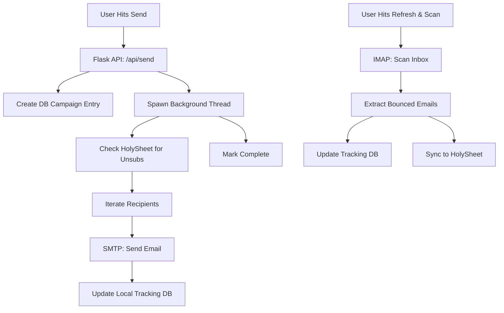

# AutoMailer 🚀

**AutoMailer** is a high-performance, professional email marketing studio built for speed, resilience, and a premium user experience. It combines a modern glassmorphic interface with robust background processing and automated bounce tracking.

---

## 📺 Project Demonstration

<div align="center">
  <video src="automailer_demo.mp4" width="100%" controls autoplay loop muted></video>
</div>

*A high-fidelity demonstration showing complete flow: Audience Upload, Hero Banner Cropping, Template Selection, and Analytics Sync.*

---

## 📑 Table of Contents
1. [Core Features](#-core-features)
2. [Technical Architecture](#-technical-architecture)
3. [Installation & Setup](#-installation--setup)
4. [Deployment Roadmap](#-deployment-roadmap)
5. [IMAP & SMTP Configuration](#-imap--smtp-configuration)
6. [The Origin Story](#-the-origin-story-discomfort-is-the-fuel)

---

## ✨ Core Features

### 🎨 Premium UI/UX
- **Glassmorphic Studio**: A slick, backdrop-blur design for crafting campaigns.
- **2x3 Analytics Grid**: High-density dashboard for real-time engagement tracking.
- **Unified Notifications**: Custom non-intrusive **Toast notifications** and **Confirmation Modals** (no more browser alerts).
- **Banner Cropper**: Integrated image editor for perfect hero-banner embedding with CID support.

### 🛡️ Resilience & Tracking
- **IMAP Bounce Scanning**: Automatically scans your inbox for delivery failures using intelligent regex and header heuristics.
- **HolySheet Integration**: Persists unsubscribes and bounces to Google Sheets, providing a global source of truth.
- **Personalization Engine**: Live, debounced markdown preview with support for `{{firstname}}` and custom tokens.

### ⚙️ Engine
- **Asynchronous Sending**: Multi-threaded dispatch ensures the UI never freezes during large campaigns.
- **Waitress/Gunicorn Ready**: Built for production-grade reliability on Render and Vercel.

---

## 🧠 Technical Architecture

AutoMailer is built as a Python Flask monolith with a focus on asynchronous background tasks.



### Key Components:
- **`web_app.py`**: The central API and threading controller.
- **`tracking_db.py`**: Local SQLite management for real-time campaign stats.
- **`static/web/utils.js`**: The UI notification and utility engine.
- **HolySheet**: Persistent external storage for exclusion lists.

---

## 🛠️ Installation & Setup

### 1. Clone & Install
```bash
git clone https://github.com/[your-repo]/AutoMailer.git
cd AutoMailer
pip install -r requirements.txt
```

### 2. Environment Variables
Create a `.env` file in the root:
```env
EMAIL_ADDRESS=your-email@gmail.com
EMAIL_PASSWORD=your-google-app-password
```

### 3. Running Locally
```bash
# Production server (Waitress)
python run_web.py

# Development server (Flask Debug)
python run_web.py --dev
```

---

## 🚀 Deployment Roadmap

Detailed instructions are available in [DEPLOYMENT.md](DEPLOYMENT.md).

### Render (Recommended)
- **Runtime**: Python 3
- **Start Command**: `gunicorn web_app:app --worker-class sync --workers 1 --bind 0.0.0.0:$PORT`
- **Why?**: Supports persistent background threads for sending and IMAP scanning.

### Vercel
- Optimized for the frontend UI. The project includes [vercel.json](vercel.json) for easy routing.

---

## 🎓 IMAP & SMTP Configuration

For AutoMailer to track bounces and send emails, you must configure your provider:

1. **Enable IMAP**: Go to Gmail Settings > Forwarding and POP/IMAP > **Enable IMAP**.
2. **App Password**: If using 2FA, generate an **App Password** from your Google Account security settings.
3. **HolySheet**: Ensure your API Key in `web_app.py` is configured for global exclusion sync.

---

## 💼 The Origin Story: Discomfort is the Fuel!

This project was built during a period of intense productivity where "discomfort" with existing tools fueled a complete overhaul. 

**Wait, here’s the kicker:** Every line of code, the UI design, the background architecture, and even the demo video in this README was generated using **Antigravity** (the agentic AI coding assistant). 

It’s a testament to how far AI has come—from simple code completion to building and documenting complex, multi-threaded applications end-to-end. Special thanks to **Shreshtth** for the recommendation that made this possible.

---

**Version**: 2.0.0 (Production Polish)  
**Main Author**: Antigravity AI  
**Collaborator**: Raghav  
**Recommendation**: Shreshtth
